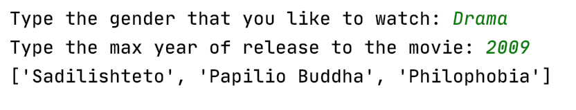

# Secret Movie Picker
- There are great movies out there, but we can't always find them, or is the one's that we already watched, this tool aim is to show you secret good movies, that you may never heard about.

## Mainly features
- IMDb movie rating via IMDb API
-- User input the name of the movie and get the `return [rating,year,genre,runtime]`

- The user chooses a set of parameteres for one movie
-- And gets three option to watch based on the parameters. 
-- The output is three movie options that have good rating but are not widely popular.

## Web APP
- Currently testing CherryPy
